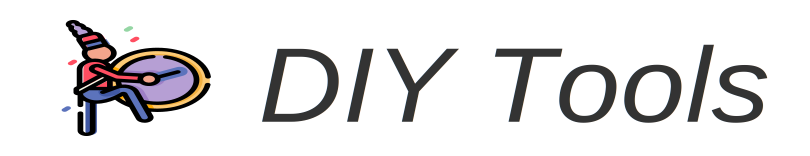

# DIY Tools app



DIY Tools is a progressive web application with 16 open source frontend focused tools.You are highly encouraged to explore source code and use it in your projects.

## Quick links

- [Contributing](./CONTRIBUTING.md)
- [Changelog](./CHANGELOG.md)

## Key features

- Fast non-blocking computations with web workers
- No tracking, no ads, no other server connections – everything runs in browser only
- Full offline support
- Dark theme support
- All-in-one application for everyday tasks

## Included Applications

- CSS Triangle Generator
- Color Shades Generator
- Gradient Generator
- Avatar Generator
- Page Dividers Generator
- SVG compressor
- SVG to JSX converter
- Base64 encoder
- Base64 decoder
- Realistic Fake Data Generator
- Password Generator
- HTML/CSS Symbols Collection
- Icon Collection
- Lorem/Samuel/Poke Ipsum Generator
- CSS Cursor Properties
- JavaScript Events Keycodes

## Local development

To get started with application locally use these commands:

```sh
# Install dependencies
yarn

# Start application, browser will open automatically
npm start
```
